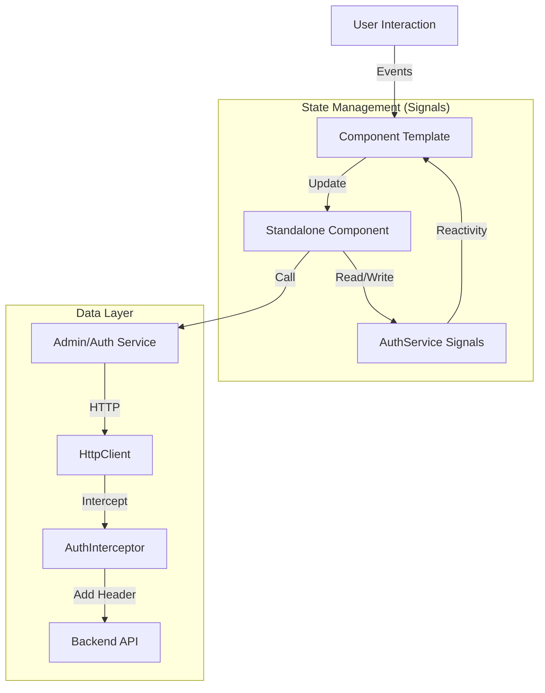

<div id="top" align="center">
<h1>Crow-Gallery - Web Frontend</h1>

<p>extending web-gallery_webserver to SCS (user management etc)</p>
<p>Part of the Crow-Gallery Project</p>

[](https://choosealicense.com/licenses/mit/)
[](https://github.com/Zheng-Bote/web-gallery_gallery-frontend/releases)

[Report Issue](https://github.com/Zheng-Bote/web-gallery_gallery-frontend/issues) · [Request Feature](https://github.com/Zheng-Bote/web-gallery_gallery-frontend/pulls)

</div>

<hr>
<!-- START doctoc generated TOC please keep comment here to allow auto update -->
<!-- DON'T EDIT THIS SECTION, INSTEAD RE-RUN doctoc TO UPDATE -->
**Table of Contents**

- [Description](#description)
  - [🚀 Features](#-features)
    - [🔐 Authentication \& Security](#-authentication--security)
    - [📸 Dashboard \& UI](#-dashboard--ui)
    - [🛠️ Administration](#️-administration)
- [⚙️ Installation \& Setup](#️-installation--setup)
- [📂 Project Structure](#-project-structure)
- [🏗️ Architecture](#️-architecture)
  - [High-Level Data Flow](#high-level-data-flow)
  - [Key Architectural Concepts](#key-architectural-concepts)
  - [🛠️ Tech Stack](#️-tech-stack)
- [📄 License](#-license)

<!-- END doctoc generated TOC please keep comment here to allow auto update -->

<hr>

# Description


**CrowGallery Frontend** is a modern, responsive single-page application (SPA) designed to manage and view photo collections. It serves as the user interface for the high-performance C++ [CrowQtServer] backend.

Built with **Angular v21**, it leverages the latest framework capabilities such as **Standalone Components**, **Signals** for fine-grained reactivity, and **Angular Material** for a polished, accessible UI.

---

## 🚀 Features

### 🔐 Authentication & Security

- **JWT Authentication:** Robust handling of Access and Refresh Tokens.
- **Role-Based Access:** Distinct capabilities for standard `User` and `Admin`.
- **Security Guards:** Functional Route Guards (`AuthGuard`, `PasswordResetGuard`) protect sensitive routes.
- **Forced Password Rotation:** Logic to enforce password changes for new users or expired credentials.
- **Automatic Token Injection:** HTTP Interceptor attaches Bearer tokens to all outgoing API requests.

### 📸 Dashboard & UI

- **Responsive Layout:** Adaptive grid system for mobile and desktop views.
- **Status Visualization:** Color-coded status indicators for user accounts (Active/Locked).
- **Modern UX:** Clean aesthetic using Material Design 3 components.

### 🛠️ Administration

- **User Management:** Admins can Create, Delete, and Deactivate users via a data table.
- **Password Resets:** Admin-triggered password resets using a dedicated Modal Dialog.

---

# ⚙️ Installation & Setup

**Prerequisites**

- Node.js (v18 or higher)
- npm
- Running instance of the CrowQtServer backend.

1. Clone the repository

```Bash
git clone https://github.com/Zheng-Bote/web-gallery_webserver-admin.git
cd web-gallery-frontend
```

2. Install Dependencies

```Bash
npm install
```

3. Configure Environment

Check `src/environments/environment.ts`. Ensure `apiUrl` points to your C++ backend.

```TypeScript
export const environment = {
  production: false,
  apiUrl: 'http://localhost:8080' // Adjust port if necessary
};
```

4. Run Development Server

```Bash
ng serve
```

Navigate to http://localhost:4200/.

# 📂 Project Structure

```bash
src/
├── app/
│   ├── components/      # Shared UI (Navbar, etc.)
│   ├── dialogs/         # Modal Dialogs (Password Reset)
│   ├── guards/          # Route protection logic
│   ├── interceptors/    # HTTP Request modification
│   ├── models/          # TypeScript Interfaces
│   ├── pages/           # Views (Dashboard, Login, Admin)
│   ├── service/         # API communication & State
│   ├── app.component.ts # Root layout
│   ├── app.config.ts    # Global provider config
│   └── app.routes.ts    # Routing definitions
└── environments/        # API configuration
```

# 🏗️ Architecture

This project adopts a **Feature-Based Architecture** using **Angular Standalone Components**. This approach eliminates `NgModules`, reducing boilerplate and improving build performance (tree-shaking).

### High-Level Data Flow



### Key Architectural Concepts

1. Signal-Driven State:

- We utilize Angular Signals (e.g., currentUser, passwordChangeRequired) instead of complex RxJS streams for synchronous state management.

- This ensures "Zoneless" compatibility and fine-grained UI updates.

2. Standalone Components:

- Components (e.g., UserManagementComponent, NavbarComponent) directly import their dependencies.

- This makes the codebase easier to refactor and test.

3. Security Layer:

- Interceptor: The authInterceptor centrally manages the Authorization header.

- Guards: Functional guards (CanActivateFn) handle redirect logic (e.g., forcing a user to change their password before accessing the dashboard).

## 🛠️ Tech Stack

- Framework: Angular v21
- Language: TypeScript 5.x
- UI Library: Angular Material v21 & CDK
- Styling: SCSS / CSS3 (Grid & Flexbox)
- Icons: Material Icons
- Build Tool: Angular CLI

# 📄 License

Distributed under the MIT License. See LICENSE for more information.
