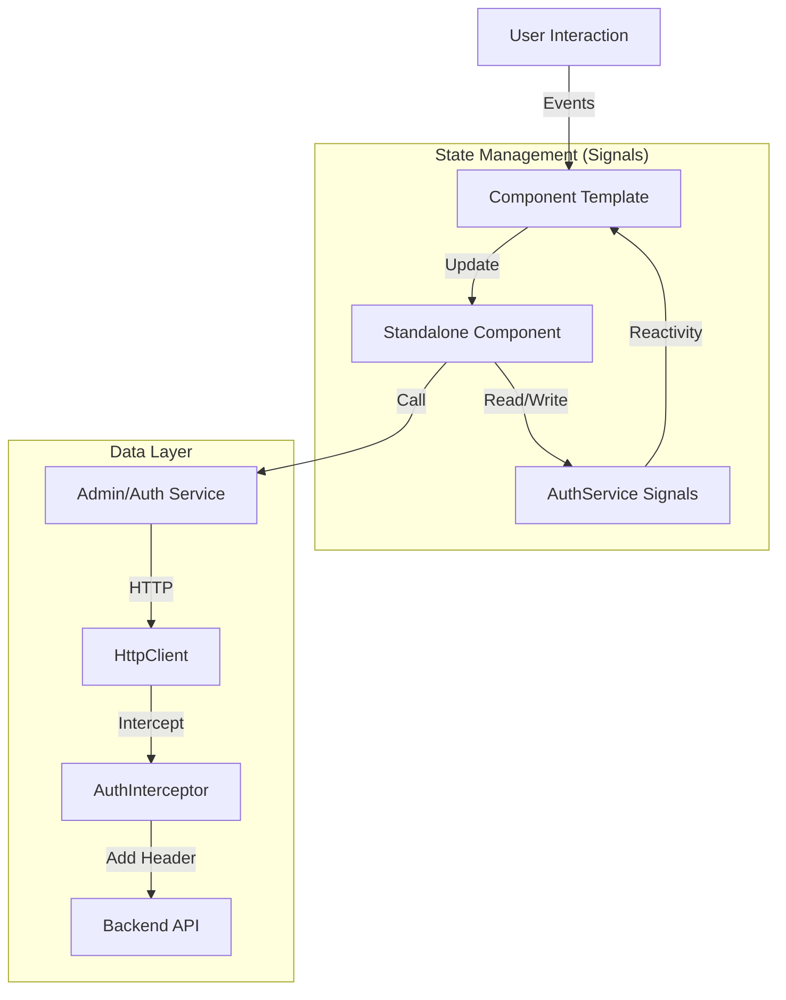

# CrowGallery - Web Frontend


**CrowGallery Frontend** is a modern, responsive single-page application (SPA) designed to manage and view photo collections. It serves as the user interface for the high-performance C++ [CrowQtServer] backend.

Built with **Angular v21**, it leverages the latest framework capabilities such as **Standalone Components**, **Signals** for fine-grained reactivity, and **Angular Material** for a polished, accessible UI.

---

## 🚀 Features

### 🔐 Authentication & Security
* **JWT Authentication:** Robust handling of Access and Refresh Tokens.
* **Role-Based Access:** Distinct capabilities for standard `User` and `Admin`.
* **Security Guards:** Functional Route Guards (`AuthGuard`, `PasswordResetGuard`) protect sensitive routes.
* **Forced Password Rotation:** Logic to enforce password changes for new users or expired credentials.
* **Automatic Token Injection:** HTTP Interceptor attaches Bearer tokens to all outgoing API requests.

### 📸 Dashboard & UI
* **Responsive Layout:** Adaptive grid system for mobile and desktop views.
* **Status Visualization:** Color-coded status indicators for user accounts (Active/Locked).
* **Modern UX:** Clean aesthetic using Material Design 3 components.

### 🛠️ Administration
* **User Management:** Admins can Create, Delete, and Deactivate users via a data table.
* **Password Resets:** Admin-triggered password resets using a dedicated Modal Dialog.

---

## 🏗️ Architecture

This project adopts a **Feature-Based Architecture** using **Angular Standalone Components**. This approach eliminates `NgModules`, reducing boilerplate and improving build performance (tree-shaking).

### High-Level Data Flow




# Doof

<pre>
Key Architectural Concepts
Signal-Driven State:

We utilize Angular Signals (e.g., currentUser, passwordChangeRequired) instead of complex RxJS streams for synchronous state management.

This ensures "Zoneless" compatibility and fine-grained UI updates.

Standalone Components:

Components (e.g., UserManagementComponent, NavbarComponent) directly import their dependencies.

This makes the codebase easier to refactor and test.

Security Layer:

Interceptor: The authInterceptor centrally manages the Authorization header.

Guards: Functional guards (CanActivateFn) handle redirect logic (e.g., forcing a user to change their password before accessing the dashboard).

🛠️ Tech Stack
Framework: Angular v21

Language: TypeScript 5.x

UI Library: Angular Material v21 & CDK

Styling: SCSS / CSS3 (Grid & Flexbox)

Icons: Material Icons

Build Tool: Angular CLI

⚙️ Installation & Setup
Prerequisites
Node.js (v18 or higher)

npm

Running instance of the CrowQtServer backend.

1. Clone the repository
Bash

git clone [https://github.com/yourusername/web-gallery-frontend.git](https://github.com/yourusername/web-gallery-frontend.git)
cd web-gallery-frontend
2. Install Dependencies
Bash

npm install
3. Configure Environment
Check src/environments/environment.ts. Ensure apiUrl points to your C++ backend.

TypeScript

export const environment = {
  production: false,
  apiUrl: 'http://localhost:8080' // Adjust port if necessary
};
4. Run Development Server
Bash

ng serve
Navigate to http://localhost:4200/.
    
</pre>


# 📂 Project Structure

```bash
src/
├── app/
│   ├── components/      # Shared UI (Navbar, etc.)
│   ├── dialogs/         # Modal Dialogs (Password Reset)
│   ├── guards/          # Route protection logic
│   ├── interceptors/    # HTTP Request modification
│   ├── models/          # TypeScript Interfaces
│   ├── pages/           # Views (Dashboard, Login, Admin)
│   ├── service/         # API communication & State
│   ├── app.component.ts # Root layout
│   ├── app.config.ts    # Global provider config
│   └── app.routes.ts    # Routing definitions
└── environments/        # API configuration

`o

# doof

<!-- readme-tree start -->
```
.
├── .github
│   ├── actions
│   │   └── doctoc
│   │       ├── README.md
│   │       ├── action.yml
│   │       └── dist
│   │           ├── index.js
│   │           ├── index.js.map
│   │           ├── licenses.txt
│   │           └── sourcemap-register.js
│   └── workflows
│       ├── ghp-call_Readme.yml
│       ├── ghp-create_doctoc.yml
│       ├── ghp-markdown_index.yml
│       ├── repo-actions_docu.yml
│       ├── repo-call_Readme.yml
│       ├── repo-create_doctoc.yml_
│       ├── repo-create_doctoc_md.yml
│       └── repo-create_tree_readme.yml
├── .gitignore
├── LICENSE
├── README.md
├── angular.json
├── docs
│   ├── about_de_dark-mode.png
│   ├── about_en_light-mode.png
│   ├── darkmode.png
│   ├── nginx.md
│   ├── photo.png
│   ├── startpage_de.png
│   ├── startpage_en.png
│   └── upload.png
├── package-lock.json
├── package.json
├── public
│   ├── favicon.ico
│   └── i18n
│       ├── about
│       │   ├── de.json
│       │   └── en.json
│       ├── de.json
│       ├── en.json
│       ├── home
│       │   ├── de.json
│       │   └── en.json
│       ├── impressum
│       │   ├── de.json
│       │   └── en.json
│       └── login
│           ├── de.json
│           └── en.json
├── src
│   ├── app
│   │   ├── app.config.ts
│   │   ├── app.css
│   │   ├── app.html
│   │   ├── app.routes.ts
│   │   ├── app.spec.ts
│   │   ├── app.ts
│   │   ├── components
│   │   │   ├── about
│   │   │   │   ├── about.component.css
│   │   │   │   ├── about.component.html
│   │   │   │   ├── about.component.spec.ts
│   │   │   │   └── about.component.ts
│   │   │   ├── breadcrumbs
│   │   │   │   ├── breadcrumbs.component.css
│   │   │   │   ├── breadcrumbs.component.html
│   │   │   │   ├── breadcrumbs.component.spec.ts
│   │   │   │   └── breadcrumbs.component.ts
│   │   │   ├── confirm-dialog
│   │   │   │   ├── confirm-dialog.component.css
│   │   │   │   ├── confirm-dialog.component.html
│   │   │   │   ├── confirm-dialog.component.spec.ts
│   │   │   │   └── confirm-dialog.component.ts
│   │   │   ├── edit-photo-dialog
│   │   │   │   ├── edit-photo-dialog.component.css
│   │   │   │   ├── edit-photo-dialog.component.html
│   │   │   │   ├── edit-photo-dialog.component.spec.ts
│   │   │   │   └── edit-photo-dialog.component.ts
│   │   │   ├── footer
│   │   │   │   ├── footer.component.css
│   │   │   │   ├── footer.component.html
│   │   │   │   ├── footer.component.spec.ts
│   │   │   │   └── footer.component.ts
│   │   │   ├── gallery
│   │   │   │   ├── gallery.component.css
│   │   │   │   ├── gallery.component.html
│   │   │   │   ├── gallery.component.spec.ts
│   │   │   │   └── gallery.component.ts
│   │   │   ├── header
│   │   │   │   ├── header.component.css
│   │   │   │   ├── header.component.html
│   │   │   │   ├── header.component.spec.ts
│   │   │   │   └── header.component.ts
│   │   │   ├── home
│   │   │   │   ├── home.component.css
│   │   │   │   ├── home.component.html
│   │   │   │   ├── home.component.spec.ts
│   │   │   │   └── home.component.ts
│   │   │   ├── impressum
│   │   │   │   ├── impressum.component.css
│   │   │   │   ├── impressum.component.html
│   │   │   │   ├── impressum.component.spec.ts
│   │   │   │   └── impressum.component.ts
│   │   │   ├── login
│   │   │   │   ├── login.component.css
│   │   │   │   ├── login.component.html
│   │   │   │   ├── login.component.spec.ts
│   │   │   │   └── login.component.ts
│   │   │   ├── navigation-tree
│   │   │   │   ├── navigation-tree.component.css
│   │   │   │   ├── navigation-tree.component.html
│   │   │   │   ├── navigation-tree.component.ts
│   │   │   │   └── tree-node.component.ts
│   │   │   ├── photo-viewer
│   │   │   │   ├── photo-viewer.component.css
│   │   │   │   ├── photo-viewer.component.html
│   │   │   │   └── photo-viewer.component.ts
│   │   │   └── upload
│   │   │       ├── upload.component.css
│   │   │       ├── upload.component.html
│   │   │       ├── upload.component.spec.ts
│   │   │       └── upload.component.ts
│   │   ├── interceptors
│   │   │   └── auth.interceptor.ts
│   │   ├── models
│   │   │   ├── auth.model.ts
│   │   │   └── photo.model.ts
│   │   ├── pipes
│   │   │   ├── webp-url.pipe.spec.ts
│   │   │   └── webp-url.pipe.ts
│   │   ├── service
│   │   │   ├── auth.guard.ts
│   │   │   ├── auth.service.spec.ts
│   │   │   ├── auth.service.ts
│   │   │   ├── gallery.service.ts
│   │   │   ├── layout.service.ts
│   │   │   ├── navigation.model.ts
│   │   │   ├── notification.service.ts
│   │   │   └── theme.service.ts
│   │   └── transloco-loader.ts
│   ├── custom-theme.scss
│   ├── environments
│   │   ├── environment.development.ts
│   │   └── environment.ts
│   ├── index.html
│   ├── main.ts
│   └── styles.css
├── transloco.config.ts
├── tree.bak
├── tsconfig.app.json
├── tsconfig.json
└── tsconfig.spec.json

34 directories, 121 files
```
<!-- readme-tree end -->
